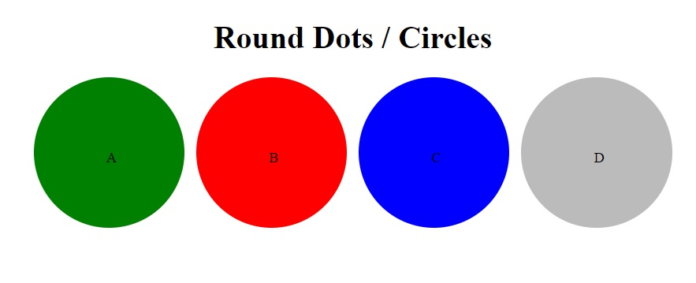

# Blazor Collection Fade In Out
Blazor Component for collections to Fade In and Out using Blazor and some javascript

[CollectionFadeInOut](Blazor.CollectionFadeInOut.Web/Blazor.CollectionFadeInOut.Web.Client/CollectionFadeInOutComponent)

I may look into making this component available on NuGet.

Sample on Blazorfiddle: https://blazorfiddle.com/s/wvjwyha1

For Blazor 8, the page must be InteractiveServer or InteractiveWebAssembly

Usage:
```html
<CollectionFadeInOut  
    Items="$Collection or List$" Context="$name of your contect items$"
    OnShowedAllItems="$optional method to call once all the collection items have been faded in and out$"
    ViewableSeconds=$optional value for the display duration in seconds for each item, default is 5 (seconds) $>
    <ItemTemplate>
        $put your own html\tags\components to display the items$
    </ItemTemplate>
</CollectionFadeInOut>
```
For example if you have a collection of circles, like in the image below, and you want to display each circle (component) one at a time (fading in and out), 
You can use the CollectionFadeInOut component wrapper around the collection so that the page shows 1 circle at a time, as shown in the subsequent images below.


using the CollectionFadeInOut component wrapper would have the page showing as below, with each circle fading in and out.


